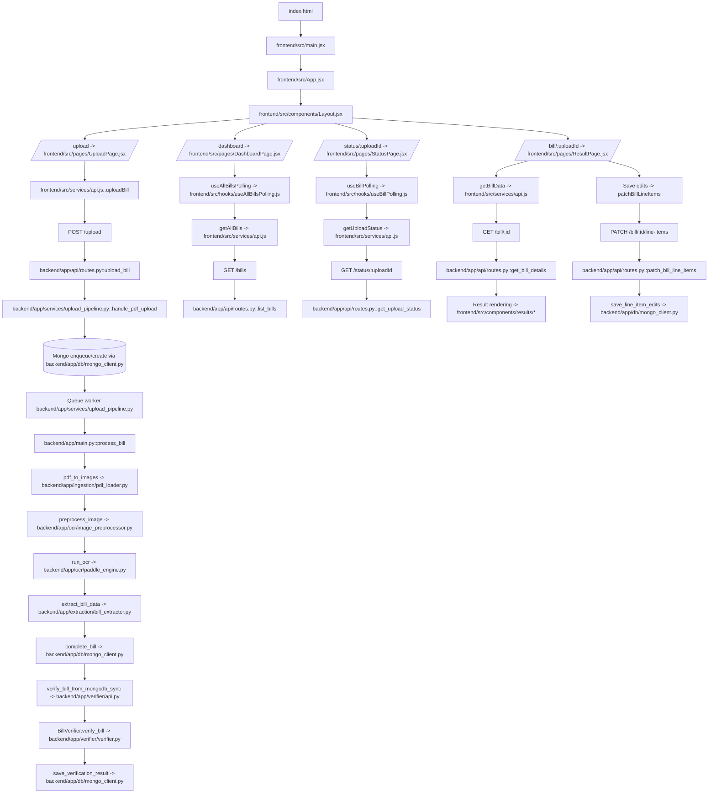

# Project Flow

## End-to-End Execution Flow

## Frontend Route to API Map

| Frontend Route | Main File | API Calls |
| --- | --- | --- |
| `/upload` | `frontend/src/pages/UploadPage.jsx` | `POST /upload` |
| `/dashboard` | `frontend/src/pages/DashboardPage.jsx` | `GET /bills`, `DELETE /bills/:id` (or fallback `/bill/:id`) |
| `/status/:uploadId` | `frontend/src/pages/StatusPage.jsx` | `GET /status/:uploadId` |
| `/bill/:uploadId` | `frontend/src/pages/ResultPage.jsx` | `GET /bill/:uploadId`, `PATCH /bill/:uploadId/line-items` |

## Backend API Entry Chain

1. `backend/server.py` starts FastAPI app.
2. It loads routes from `backend/app/api/routes.py`.
3. Startup event starts queue worker in `backend/app/services/upload_pipeline.py`.
4. Uploads are processed asynchronously by worker, then verification is auto-run.

## Notes

- Frontend base URL is `/api` in `frontend/src/services/api.js`.
- Vite dev proxy rewrites `/api/*` to backend `http://127.0.0.1:8001/*` via `frontend/vite.config.js`.
- Current UX goes upload -> dashboard immediately after submit, while status page remains available by route.
